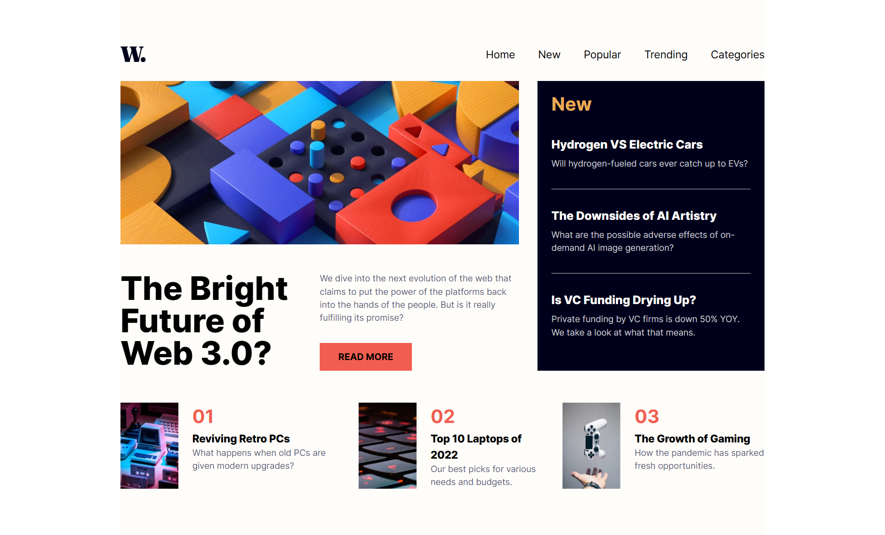

# News Homepage

A news homepage that displays the latest articles and allows users to easily navigate through different categories.



## Features

Users are able to:

- View the optimal layout for the interface depending on their device's screen size
- See hover and focus states for all interactive elements on the page

## Technologies used

- ASTRO
- TAILWIND

## Video explanation
[](https://www.youtube.com/watch?v=wjhDao9k2AQ)

## Getting Started

To run this project locally, follow these steps:

1. Clone the repository:
   ```bash
   git clone https://github.com/CodinGitHub/news-homepage
   ```  
2. Navigate to the project directory:
   ```bash
   cd news-homepage
   ```
3. Install the dependencies:
   ```bash
   npm install
   ```
4. Start the development server:
   ```bash
   npm run dev
   ```

## Author

David Ruiz - Frontend Developer
- [Github](https://github.com/Davichobits)
- [Frontend Mentor](https://www.frontendmentor.io/profile/Davichobits) 
- [Linkedin](https://www.linkedin.com/in/davidirc/)
- [YouTube](https://www.youtube.com/CodingTube)
- [codingtube.dev](https://codingtube.dev/)

## GitAds Sponsored
[](https://gitads.dev/v1/ad-track?source=codingithub/codingithub@github)
